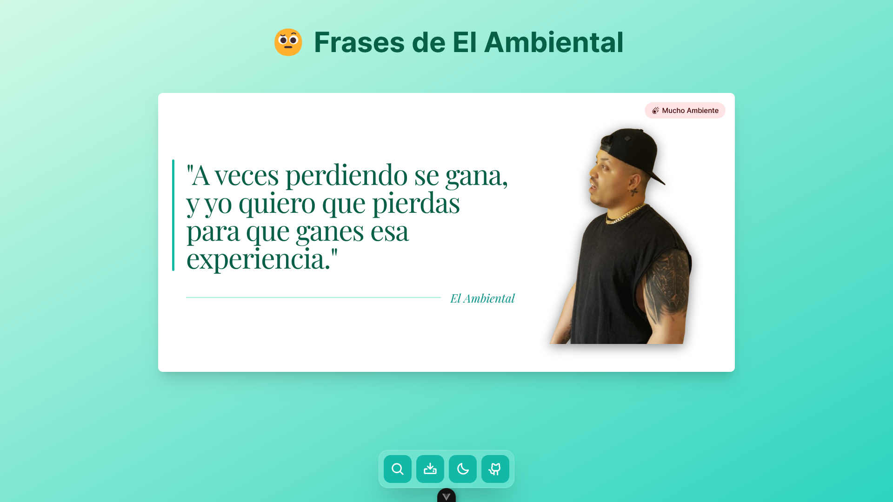

# 👾 Contributing to `Vue Quotes` 👾

First of all, thank you for taking the time to consider contributing to this project! Your involvement is crucial to the success and growth of `Vue Quotes`. We appreciate your willingness to help improve the project and make it more useful for everyone. 😋

This repository is licensed under the MIT License, which means you are free to use, modify, and distribute the code for personal or commercial purposes. However, if you would like to contribute back to the project, we welcome you with open arms! Here’s how you can contribute:

## Table of Contents
1. [Getting Started](#getting-started)
2. [Ways to Contribute](#ways-to-contribute)
   - [Standard Mode: Reporting Issues](#standard-mode-reporting-issues)
   - [Pro Mode: Submitting Code](#pro-mode-submitting-code)
3. [Setting Up Your Development Environment](#setting-up-your-development-environment)
4. [Code of Conduct](#code-of-conduct)
5. [Style Guide](#style-guide)
6. [Submitting Changes](#submitting-changes)
7. [Additional Resources](#additional-resources)

## Getting Started

Before contributing, please take a moment to familiarize yourself with the project. Review the documentation and existing issues to understand what has already been accomplished and what areas need improvement.

### Prerequisites
- Familiarity with Git and GitHub.
- Knowledge of Vue.js and JavaScript.

## Ways to Contribute

There are multiple ways you can contribute to `Vue Quotes`:

### Standard Mode: Reporting Issues
If you encounter any bugs or have suggestions for new features, please report them in the [Issues](https://github.com/nataliajusticia/vue-quotes/issues) section of this repository. When reporting an issue, please include:
- A clear and descriptive title.
- A detailed description of the issue.
- Steps to reproduce the issue (if applicable).
- Screenshots or logs that may help in diagnosing the problem.

### Pro Mode: Submitting Code
If you're looking to contribute code, follow these steps:
1. **Fork the Repository:** Click on the "Fork" button at the top right corner of this page.
2. **Clone Your Fork:** Clone your forked repository to your local machine using:
```bash
  git clone https://github.com/EduardoProfe666/vue-quotes.git
```
3. **Create a New Branch:** Create a new branch for your feature or bug fix:
```bash
  git checkout -b feature/your-feature-name
```
4. **Make Your Changes:** Implement your changes in this new branch.
5. **Commit Your Changes:** Commit your changes with a clear message:
```bash
    git commit -m "Add feature: your feature description"
```
6. **Push Your Changes:** Push your changes back to your forked repository:
```bash
  git push origin feature/your-feature-name
```
7. **Create a Pull Request:** Go to the original repository and click on "Pull Requests." Then click "New Pull Request" and select your branch.

## Setting Up Your Development Environment

To set up your development environment for `Vue Quotes`, follow these steps:

1. **Clone the Repository:**
```bash
git clone https://github.com/EduardoProfe666/vue-quotes.git
cd vue-quotes
```

2. **Install Dependencies:** Depending on the project's requirements, install necessary dependencies using:
```bash
    npm install
    
    # or Yarn
    yarn install
    
    # or pnpm
    pnpm install
```

## Code of Conduct

We expect all contributors to adhere to our [Code of Conduct](CODE_OF_CONDUCT.md). This document outlines our expectations for participant behavior and provides guidelines for reporting unacceptable behavior.

## Style Guide

To maintain consistency throughout the codebase, please follow our style guide:
- Use meaningful variable names.
- Write clear and concise comments where necessary.
- Follow Vue.js conventions.
- Ensure that your code is properly formatted before submitting.

## Submitting Changes

When you're ready to submit your changes, please ensure that:
- Your code passes all tests.
- You have updated any relevant documentation.
- You have added any necessary tests for new features.

After creating a pull request, be prepared for feedback from project maintainers and be open to making adjustments based on their suggestions.

## Additional Resources

For more information on contributing, consider reviewing these resources:
- [GitHub Guides: How to Contribute to Open Source](https://guides.github.com/activities/contributing-to-open-source/)
- [How to Write a Great Pull Request Message](https://chris.beams.io/posts/git-commit/)
- [Understanding the GitHub Flow](https://guides.github.com/introduction/flow/)

Thank you once again for considering contributing to `Vue Quotes`. Your contributions help make this project better for everyone!